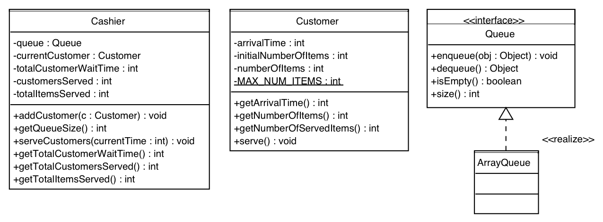

# ITI 1121 - Lab 08

## Submission

Please read the [junit instructions](JUNIT.en.md) for help
running the tests for this lab.

Please read the [Submission Guidelines](SUBMISSION.en.md) carefully.
Errors in submitting will affect your grades.

Submit your answers to

* Queue.java
* ArrayQueue.java
* Customer.java
* Cashier.java

### Learning objectives

*   Understanding of queue-based algorithms
*   Understanding array-based and linked list queue implementations


## Introduction

We all know of many applications of queues in “real-world” situations. A prime example are the waiting lines. In order to improve customer service, techniques are sought to reduce the average waiting time, or the average length of the queue. For airlines companies, this could be to have waiting lines for regular customers, as well as waiting lines for the frequent flyers. For a supermarket, this would the use of express lines for customers with few items, as well as regular waiting lines.

However, in order to select the best strategy, e.g. adding 1, 2 or 3 express lines, managers need tools to estimate the value of certain parameters, such as the average waiting time, so as to implement cost effective solutions.

The are two main approaches to obtain these estimates. **Queuing theory** is a branch of mathematics that studies waiting lines. The alternative is to build **computer** simulations of these “real-world” systems, and measure the values of the parameters with help of the simulations.

For this laboratory, we are developing a computer simulation for a supermarket that has express and regular lines. These waiting lines will be implemented with the help of queues.

### Implementing a queue

First of all, make sure that you understand the implementation of a queue. We will start by implementing the queue using an array.

*   [Queue.java](https://www.site.uottawa.ca/~gvj/Courses/ITI1121/lectures/labs/lab8_template/Queue.java)

#### The methods
```java
    public interface Queue<E> {

        public abstract void enqueue( E obj );
        public abstract E dequeue();
        public abstract boolean isEmpty();
        public abstract int size();

    }
```
*   **void enqueue**: Add an element to the back of the queue
*   **E dequeue**: Remove and return the first element of the queue
*   **boolean isEmpty**: Returns _true_ if the queue is empty, _false_ otherwise
*   **int size**: Returns the number of elements in the queue

#### Implementing a queue with an array

A queue always has to follow the "first in first out" (FIFO) algorithm. You can see that the implementation **ArrayQueue** uses **front** to represent the index of the first element in the queue (the next one to be removed) as well as **rear** to represent the index of the last element of the queue (-1 if the queue is empty). The variable **size** allows us to track the actual size of the queue (don’t forget that **elems.length** is not the same as size unless the queue is full!). Finally, it is in the array **E elems[]** that the elements of the queue will be saved.

*   [ArrayQueue.java](https://www.site.uottawa.ca/~gvj/Courses/ITI1121/lectures/labs/lab8_template/ArrayQueue.java)

```java
    1 public class ArrayQueue<E> implements Queue<E> {
    2
    3     // Constant
    4
    5     private static final int MAX_QUEUE_SIZE = 10000;
    6
    7     // Instance variables
    8
    9     private E[] elems; // stores the elements of this queue
    10    private int front, rear, size;
    11
    12    @SuppressWarnings( "unchecked" )
    13
    14    public ArrayQueue() {
    15        elems = (E []) new Object[MAX_QUEUE_SIZE];
    16        front =  0;
    17        rear = -1;
    18        size = 0;
    19    }
    20
    21    // Instance methods
    22
    23    public int size() {
    24        return size;
    25    }
    26
    27    public boolean isEmpty() {
    28        return size == 0;
    29    }
    30
    31    public boolean isFull() {
    32        return size == MAX_QUEUE_SIZE;
    33    }
    34
    35    public void enqueue( E elem ) {
    36
    37        // pre-condition: ???
    38
    39        if ( rear == ( MAX_QUEUE_SIZE -1 ) ) {
    40
    41            int j=0;
    42            for ( int i=front; i<=rear; i++ ) {
    43                elems[ j++ ] = elems[ i ];
    44            }
    45
    46            front = 0;
    47            rear = size - 1;
    48
    49        }
    50
    51        elems[ ++rear ] = elem;
    52        size++;
    53    }
    54
    55    public E dequeue() {
    56
    57        // pre-condition: ???
    58
    59        E saved = elems[ front ];
    60        elems[ front ] = null; // scrubbing the memory!
    61
    62        front++;
    63        size--;
    64
    65        return saved;
    66    }
    67
    68 }
```
**Note**: when we remove the element at the position **front** in the method **dequeue**, we assign the value **null** to this element and increment front so that the next element becomes the first element of the queue. This causes a shift in the array where the first elements are **null** up to the position **front**. When the array **elems[]** with which we implement our queue is full, it is probable that there is in fact some available space in the first elements of the array because of a call to the method **dequeue**. The **lines 39 to 49** allow us to shift the array to the left in the case where the variable **rear** has reached the end of the array.

Take some time to determinate the precondition to each method.

#### Implementing a queue with linked elements.

*   [LinkedQueue.java](https://www.site.uottawa.ca/~gvj/Courses/ITI1121/lectures/labs/lab8_template/LinkedQueue.java)
```java
    public class LinkedQueue<E> implements Queue<E> {

        private static class Elem<T> {

            private T value;
            private Elem<T> next;

            private Elem(T value, Elem<T> next) {
                this.value = value;
                this.next = next;
            }
        }

        private Elem<E> front;
        private Elem<E> rear;
      private int size;

      public LinkedQueue() {
        size = 0;
        }

        public int size() {
            return size;
        }

        public void enqueue(E value) {
            Elem<E> newElem;
            newElem = new Elem<E>(value, null );

            if (rear == null) {
                front = rear = newElem;
            } else {
                rear.next = newElem;
                rear = newElem;
            }
        size++;
        }

        public E dequeue() {
            E result = front.value;
            if (front != null && front.next == null) {
                front = rear = null;
            } else {
                front = front.next;
            }
        size--;
            return result;
        }

        public boolean isEmpty() {
            return front == null;
        }

    }
```
This implementation is quite different from the previous one. This time we use 3 instance variables, **Elem front**, **Elem rear** and **int size**. What is an object of type **Elem**? It comes from the static private **nested class** Elem in which we save the actual value of the element in the queue (a generic type T) as well as a reference to the next element in the queue. This way, **front** is a reference to the first **Elem** of the queue while **rear** is the last **Elem** of the queue.

**Some questions to consider:**

*   In what situation would front == rear?
*   Can the queue be full?
*   Without the variable **size**, how could we determinate the size of the queue?


## Application

 **Figure 1 :** Main classes for the simulation.

The above figure shows the UML diagrams of the two main classes for the simulation. In addition to these classes, there is an interface, called Queue, as well as a simple implementation, called ArrayQueue. The source code is provided below.

### Customer

Write a class for modeling a customer. A customer knows its arrival time (represented by an **int** value), its initial number of items, as well as the number of items remaining to be processed. The maximum number of items per customer is (**MAX_NUM_ITEMS**).

*   What are the **instance variables**?
*   What are the **class variables**?

The constructor has a single parameter. It specifies the arrival time. The initial number of items is determined when the object is first created using the following formula:
```java
    Random generator;
    generator = new Random();

    int numItems;
    numItems = generator.nextInt(MAX_NUM_ITEMS-1)+1;
```
Here, we make sure that no customer would show up empty handed!

The instance methods of a customer include:

*   **int getArrivalTime()** returns the arrival time;
*   **int getNumberOfItems()** returns the number of items remaining to be processed;
*   **int getNumberOfServedItems()** returns the number of items that have been processed;
*   **serve()** decrements by one the number of items of this customer.

### Cashier

A cashier is responsible for helping a queue of customers. It serves one customer at a time. Since the simulation is used to produce statistics, a cashier also memorizes the total number of customers served, the total amount of time the customers have been waiting, as well as the total number of items served (processed).

*   What are the instance variables? What are the class variables?

The class has a single constructor. It has no parameters. It initializes the instance variables of the cashier.

The method **addCustomer( Customer c )** adds a customer to the rear of its queue. The method **int getQueueSize()** returns the number of customers currently waiting in line.

The method **serveCustomers( int currentTime )** is a key element of the simulation. The method **serveCustomers** of each cashier is called once for each step of the simulation. The parameter **currentTime** is used to compute the total amount of time this customer has spent waiting in line. Here is the behaviour of the cashier when serving customers.

*   If the cashier is not presently serving a customer, the next customer in line becomes the current customer, unless the queue is empty. Whenever, a customer is taken out of the queue, the cashier tallies the total amount time this customer spent waiting in line. If the cashier has no customer and the queue is empty, there is nothing to be done for this step;
*   The cashier serves one item (a call to the method serve() of its current customer);
*   If the current customer has no more items, the cashier adds the number of items of this customer to the tally. The state of this cashier object now indicates that this cashier has no current customer (the customer has been sent away).

There are also 3 instance methods used to report statistics for the total waiting time, total number of items served and total number of customers served by this cashier: **int getTotalCustomerWaitTime()**, **int getTotalItemsServed()**, and **int getTotalCustomersServed()**. Finally, the **String toString()** method returns a String that summarizes the statistics of this cashier.

Here are the files needed for the Queue implementation:

*   [Queue.java](https://www.site.uottawa.ca/~gvj/Courses/ITI1121/lectures/labs/lab8_template/Queue.java)
*   [ArrayQueue.java](https://www.site.uottawa.ca/~gvj/Courses/ITI1121/lectures/labs/lab8_template/ArrayQueue.java)

### Simulation

*   [Simulation.java](https://www.site.uottawa.ca/~gvj/Courses/ITI1121/lectures/labs/lab8_template/Simulation.java)

The class **Simulation** orchestrates the simulation. A **Simulation** object has two cashiers; one is responsible for the express line, the other for the regular line. The object also memorizes the duration of the simulation. The constructor creates the two necessary cashier objects.

The method **run()** implements the main loop of the simulation. It sets the current time to zero then increments the current time by a fixed amount (TICK) at each iteration.

At each iteration, the method **run** must:

*   Determine if a new customer has arrived, and if so place this customer in the appropriate waiting line (based on the number of items);
*   Tell the two cashiers to serve their customers;
*   Increment the current time.

At the end of the simulation, the method **run()** displays the statistics.

1.  Execute the simulation several times. Discuss your observations with your neighbours. Here is an example of a run:

    SIMULATION ::
    The duration (in seconds) of the simulation was 28800
```java
    EXPRESS LINE ::
    The total number of customers served is 376
    The average number of items per customer was 6
    The average waiting time (in seconds) was 16

    REGULAR LINE ::
    The total number of customers served is 311
    The average number of items per customer was 18
    The average waiting time (in seconds) was 2597
```
3.  As you can see, the average waiting time for the express line was short (16 seconds!) but the customers in the regular line are waiting nearly 45 minutes. The manager needs to add more regular lines. But how many lines should be added? To answer this question, you will need to modify this application to allow for more regular lines;
4.  If time allows, experiment with different parameter values: change the probability of an arrival, the number of items, the number of regular and express checkout lines.

### Resources

*   [https://docs.oracle.com/javase/tutorial/getStarted/application/index.html](https://docs.oracle.com/javase/tutorial/getStarted/application/index.html)
*   [https://docs.oracle.com/javase/tutorial/getStarted/cupojava/win32.html](https://docs.oracle.com/javase/tutorial/getStarted/cupojava/win32.html)
*   [https://docs.oracle.com/javase/tutorial/getStarted/cupojava/unix.html](https://docs.oracle.com/javase/tutorial/getStarted/cupojava/unix.html)
*   [https://docs.oracle.com/javase/tutorial/getStarted/problems/index.html](https://docs.oracle.com/javase/tutorial/getStarted/problems/index.html)
